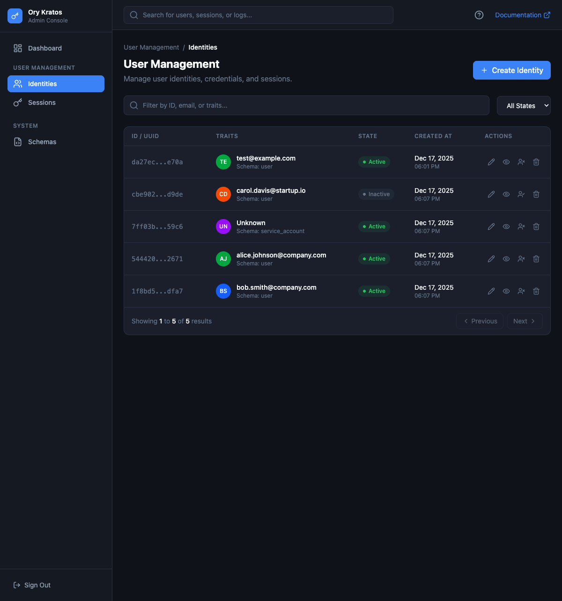

# Kratos Admin UI

A modern administration console for [Ory Kratos](https://www.ory.sh/kratos/) identity management system.



## Features

- **Identity Management**: List, create, edit, and delete user identities
- **Session Management**: View and revoke active sessions
- **Schema Viewer**: Browse configured identity schemas
- **Dashboard**: Overview statistics and quick actions
- **Secure Authentication**: JWT-based authentication with static admin password

## Tech Stack

### Backend
- Go 1.21+ with Gin framework
- JWT authentication
- Ory Kratos Go SDK

### Frontend
- Vue 3 with TypeScript
- Vite build tool
- Tailwind CSS
- Pinia state management

## Getting Started

### Prerequisites

- Go 1.21 or later
- Node.js 20 or later
- Docker and Docker Compose (optional)
- Running Ory Kratos instance

### Environment Setup

1. Copy the example environment file:
   ```bash
   cp .env.example .env
   ```

2. Edit `.env` and set your configuration:
   ```bash
   ADMIN_PASSWORD=your-secure-password
   JWT_SECRET=your-jwt-secret
   KRATOS_ADMIN_URL=http://localhost:4434
   ```

### Development

#### Backend

```bash
cd backend
go mod download
go run ./cmd/server
```

The backend API will be available at `http://localhost:8080`.

#### Frontend

```bash
cd frontend
npm install
npm run dev
```

The frontend will be available at `http://localhost:5173`.

### Using Docker

Build and run all services:

```bash
docker-compose up -d
```

Services:
- Frontend: `http://localhost:3000`
- Backend API: `http://localhost:8080`
- Kratos Public: `http://localhost:4433`
- Kratos Admin: `http://localhost:4434`

### Using Make

```bash
# Build everything
make build

# Run in development mode
make dev

# Start Docker containers
make docker-up

# View all available commands
make help
```

## API Endpoints

| Method | Endpoint | Description |
|--------|----------|-------------|
| POST | `/api/auth/login` | Authenticate with admin password |
| GET | `/api/identities` | List identities (paginated) |
| GET | `/api/identities/:id` | Get single identity |
| POST | `/api/identities` | Create new identity |
| PUT | `/api/identities/:id` | Update identity |
| DELETE | `/api/identities/:id` | Delete identity |
| GET | `/api/identities/:id/sessions` | Get identity sessions |
| GET | `/api/sessions` | List all sessions |
| DELETE | `/api/sessions/:id` | Revoke a session |
| GET | `/api/schemas` | List identity schemas |
| GET | `/api/stats` | Dashboard statistics |

## Docker Images

Docker images are automatically built and published to GitHub Container Registry on tagged releases.

```bash
# Pull the images
docker pull ghcr.io/YOUR_USERNAME/kratos-admin-backend:latest
docker pull ghcr.io/YOUR_USERNAME/kratos-admin-frontend:latest
```

## Project Structure

```
kratos-admin-ui/
├── backend/
│   ├── cmd/server/         # Application entry point
│   ├── internal/
│   │   ├── auth/           # Authentication handlers
│   │   ├── config/         # Configuration
│   │   ├── handlers/       # API handlers
│   │   └── kratos/         # Kratos client
│   └── Dockerfile
├── frontend/
│   ├── src/
│   │   ├── api/            # API client
│   │   ├── components/     # Vue components
│   │   ├── stores/         # Pinia stores
│   │   ├── views/          # Page components
│   │   └── router/         # Vue Router config
│   ├── Dockerfile
│   └── nginx.conf
├── .github/workflows/      # CI/CD workflows
├── docker-compose.yml
└── Makefile
```

## License

MIT


